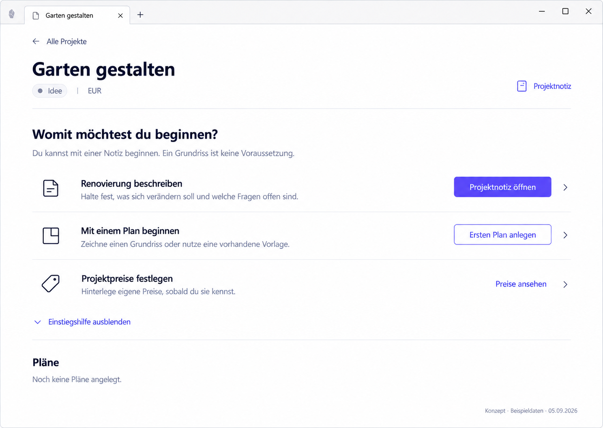

# P01 — New project without a plan



> Generated concept mockup with sample data, not an implementation screenshot. Original images illustrate German UI localization. English specification rules and the [UI copy table](../ui-copy.md) take precedence over incidental image details.

## Purpose and entry
Start a useful action without a floor plan or complete metadata. Enter after successful creation or when opening a project with a reliably empty plan list.

## Layout
Project header: back, name, status, currency, secondary note access. Below: “What would you like to start with?” and three vertical entries: Describe your renovation; Start with a plan; Set project prices. Explain once that a floor plan is optional. Keep the plan region compact; no second identical creation action.

## Interactions
| Trigger | Result |
| --- | --- |
| Open project note | Ordinary project note, no new domain wizard |
| Create first plan | Existing creation; subsequent import/reference setup follows editor contract |
| View prices | P04 in the same project |
| Hide getting-started guidance | Explanations disappear; note, plan creation, and prices remain |
| All projects | P00 |

## Use cases
- UC-P01-01: Start a garden renovation with a description.
- UC-P01-02: Create a first plan without first entering prices.
- UC-P01-03: Continue setup later without mandatory steps.

## Components
ProjectHeader, ProjectEntryGuidance, ProjectEntryAction, PlanList/EmptyState, GuidanceVisibilityControl; existing form and note navigation.

## Data contract
Project ID, name, status, currency, reliably empty plan list. No completion percentage derived from filled metadata.

## Empty, error, and special states
Failed creation retains form values. If plan creation fails after project creation, the project remains available. Unreadable plans show a read-error state, not this “new” layout.

## Keyboard, focus, and narrow layouts
Use semantic headings and separately labelled actions. Hiding guidance moves focus to Show guidance. Narrow actions sit below descriptions.

## Acceptance criteria
- A useful path without drawing exists.
- Only one primary note action; header access is secondary.
- Guidance can be shown again.
- Hiding guidance removes no core capability.

```gherkin
Given a new project has no plan
When I choose "Open project note"
Then I can describe the renovation
And no plan is required or automatically created
```

## Image clarifications
“Existing template” promises no new template catalogue. It means the existing reference-plan/import path, where available.

## Shared rules and verification

The [state/navigation rules](../states-and-navigation.md), [component library](../components/component-library.md), and [repository reconciliation](../implementation/repository-reconciliation-and-backlog.md) also apply. Document/image links are checked in this package. Runtime interactions, theme contrast, and screen-reader behavior have not been verified in the plugin. See the [verification plan](../implementation/verification-plan.md).

