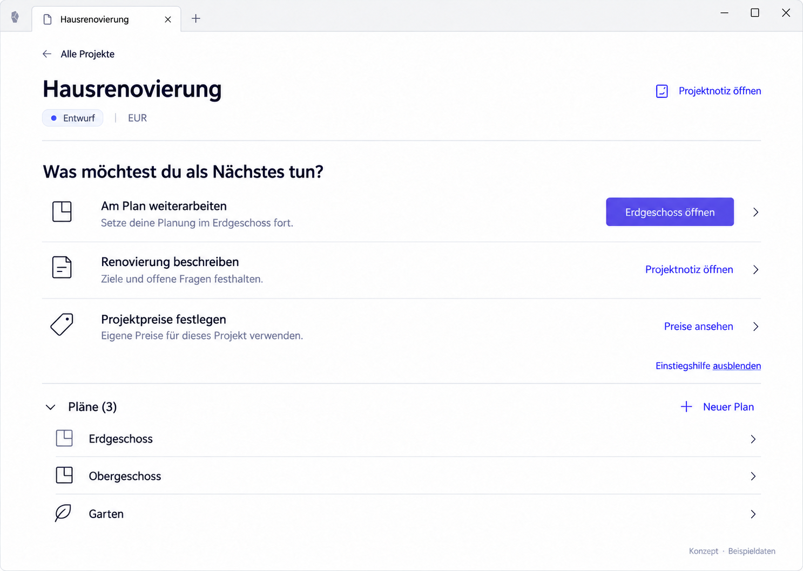

# P02 — Active project



> Generated concept mockup with sample data, not an implementation screenshot. Original images illustrate German UI localization. English specification rules and the [UI copy table](../ui-copy.md) take precedence over incidental image details.

## Purpose and entry
Understand project context and continue deliberately with few actions. Enter by opening a project with at least one readable plan.

## Layout
Project header → “What would you like to do next?” → three optional entries → expanded plan list. Guidance order is stable; only the specific plan action adapts to valid context. No entire price catalogue beneath plans.

## Interactions
| Trigger | Result |
| --- | --- |
| Open Ground floor | Exactly that named plan |
| No valid last plan, but plans exist | “Choose a plan” focuses plans; never choose arbitrarily |
| Open project note | Associated note |
| View prices | P04 |
| Hide guidance | Plans move upward; compact note/price access remains |
| Plan row | Editor for the chosen ID |
| New plan | Existing creation form |
| Collapse plans | Optional UI state, no data loss |

## Use cases
- UC-P02-01: Continue ground-floor planning.
- UC-P02-02: Deliberately open another plan.
- UC-P02-03: Hide explanations and work directly with plans.

## Components
ProjectHeader, ProjectEntryGuidance, ProjectEntryAction, PlanList, GuidanceVisibilityControl, PersistentWarningStrip.

## Data contract
ProjectSummaryDto and PlanSummaryDto; the latter has ID/name, no per-plan date. Resume uses the existing UI/application boundary. No invented room/task counts.

## Empty, error, and special states
Partial unreadability adds a warning. Price errors affect P04, not plans. A reliably missing project shows an explanation and deliberate return. Dynamic hints never remove a focused action.

## Keyboard, focus, and narrow layouts
Do not nest buttons inside interactive entry buttons. Decorative chevrons add no focus stop. P05 is dark; P07 is narrow.

## Acceptance criteria
- Correct project/plan IDs when opening.
- Plans initially visible.
- No per-plan dates without a new query.
- No mandatory guidance or automatic progress.

```gherkin
Given a project has three plans
When I hide the getting-started guidance
Then all three plans, the note, and project prices remain accessible
And I can show the guidance again
```

## Image clarifications
The corrected header uses EUR. Accent is illustrative, not prescribed purple.

## Shared rules and verification

The [state/navigation rules](../states-and-navigation.md), [component library](../components/component-library.md), and [repository reconciliation](../implementation/repository-reconciliation-and-backlog.md) also apply. Document/image links are checked in this package. Runtime interactions, theme contrast, and screen-reader behavior have not been verified in the plugin. See the [verification plan](../implementation/verification-plan.md).

