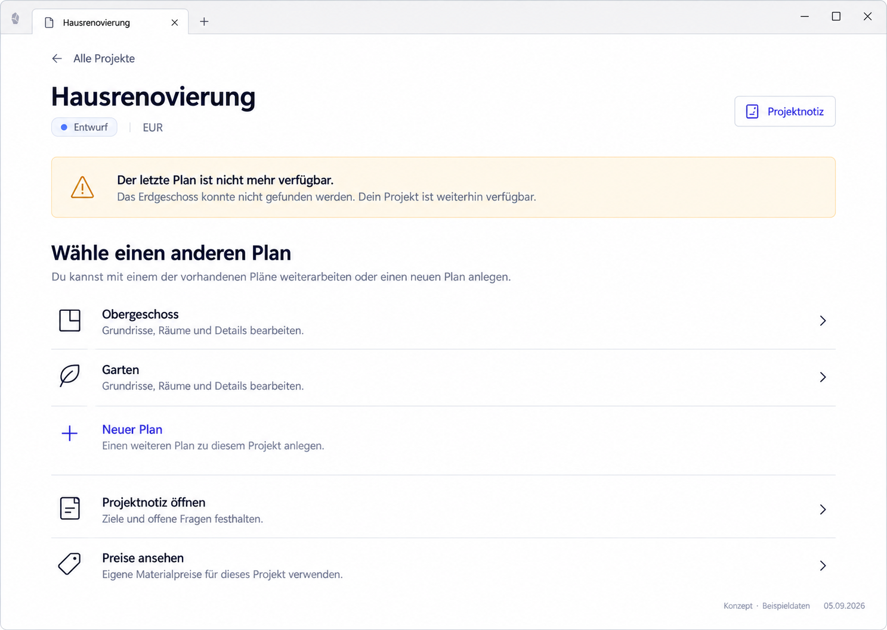

# P03 — Resume recovery: last plan missing



> Generated concept mockup with sample data, not an implementation screenshot. Original images illustrate German UI localization. English specification rules and the [UI copy table](../ui-copy.md) take precedence over incidental image details.

## Purpose and entry
Remain able to work after an invalid Resume target without losing project context. Enter after successful validation confirms that the project exists but its last plan is missing.

## Layout
Keep project header. Add a persistent warning naming the missing plan. “Choose another plan” precedes actual remaining plans. Note, prices, and plan creation remain accessible.

## Interactions
| Trigger | Result |
| --- | --- |
| Existing plan | Open that plan |
| New plan | Deliberate creation in this project |
| Open project note | Associated note |
| All projects | Explicit return |
| Validation fails instead of confirming absence | Read error, not a missing-plan claim |

## Use cases
- UC-P03-01: Choose another plan after removal of the last one.
- UC-P03-02: Continue the project note instead of drawing again.
- UC-P03-03: Distinguish missing content from read failure.

## Components
ProjectHeader, ResumeResolution/Controller, PersistentWarningStrip, PlanList, existing navigation actions.

## Data contract
Distinguish pending, valid-plan, valid-project-only, missing-plan, missing-project, read-failed. Conceptual states, not prescribed domain enums.

## Empty, error, and special states
If the project is also reliably missing, show a separate unavailable view with All projects. No deletion claim before indexing completes. No retry for confirmed missing plan, no automatic substitute. With no remaining plans, explain emptiness and offer deliberate creation.

## Keyboard, focus, and narrow layouts
Warning uses icon/text, not only yellow. Announce without repeated live-region noise. After failed resumption, focus explanation/heading meaningfully, not an unrelated button.

## Acceptance criteria
- Absence and read failure are distinct.
- Missing plan has no active Open action.
- No history entry that creates a return loop.

```gherkin
Given the last plan was removed and the project exists
When I choose "Resume"
Then I see project context and an explanation
And I can deliberately select another plan
And no redirect loop occurs
```

## Image clarifications
Two remaining plans are an example, not a fixed count.

## Shared rules and verification

The [state/navigation rules](../states-and-navigation.md), [component library](../components/component-library.md), and [repository reconciliation](../implementation/repository-reconciliation-and-backlog.md) also apply. Document/image links are checked in this package. Runtime interactions, theme contrast, and screen-reader behavior have not been verified in the plugin. See the [verification plan](../implementation/verification-plan.md).

