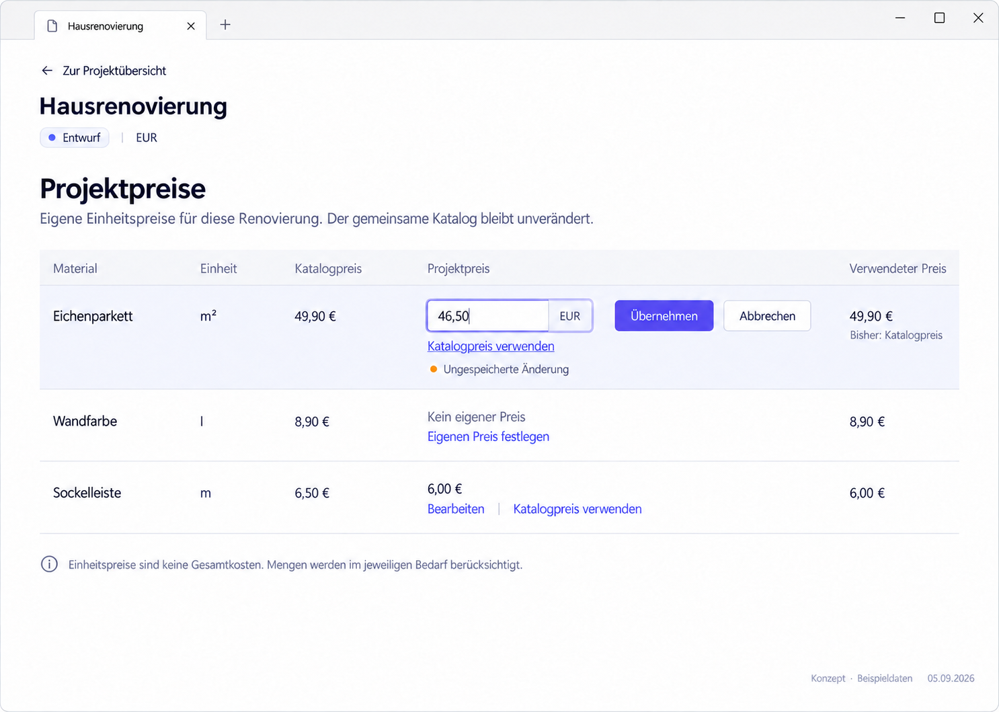

# P04 — Edit project prices



> Generated concept mockup with sample data, not an implementation screenshot. Original images illustrate German UI localization. English specification rules and the [UI copy table](../ui-copy.md) take precedence over incidental image details.

## Purpose and entry
Set project-specific unit prices without changing the shared catalogue or other projects. Enter via View prices. Binding back label: “Back to project”.

## Layout
Project name/currency → explanation → price rows. Per asset: name, catalogue price, saved project price/draft, and price usable under domain rules. Show a unit only when verified data supplies it: today's row DTO has no unit field. One local editor is open in the mockup; no global Save button.

## Interactions
| Trigger | Result |
| --- | --- |
| Set project price / Edit | Local draft with starting version |
| Apply | Validate, use existing write path; change used value after confirmed success only |
| Cancel | Discard draft; retain saved state |
| Remove project price | Clear saved override through command; catalogue unchanged |
| Back with draft | Discard / Keep editing; no silent loss |
| External price change | Respect version/conflict rule; retain draft |

## Use cases
- UC-P04-01: Record a cheaper quote as a project unit price.
- UC-P04-02: Remove an override and return to catalogue where usable.
- UC-P04-03: Cancel input without changing effective prices.

## Components
ProjectHeader, ProjectPricesSection, AssetPriceList/Row, MoneyInput, FieldError, DirtyState, UnsavedChangesDialog. Reuse commands and optimistic concurrency.

## Data contract
AssetPriceRowDto/existing read model and commit interface. Currency belongs to project; check catalogue/project currencies separately. No silent FX or totals without quantities. UI draft/persisted distinction is not persistence. Keep unreadable/orphan rows: setting may be disabled while removing a saved override remains allowed.

## Empty, error, and special states
Field-local errors retain input. On conflict, inspect current state and deliberately reapply; never blindly replace expected version. Prevent duplicate Apply. Price read errors retain project access. Refresh failure after successful write must not become “Not saved”.

## Keyboard, focus, and narrow layouts
Label identifies asset/currency; errors use aria-describedby. Escape cancels local drafts where dialog/write state permits. Narrow desktop uses vertical labelled value pairs and actions below, not five squeezed columns. Mobile remains read-only.

## Acceptance criteria
- Project changes leave catalogue unchanged.
- Used price never shows unsaved drafts.
- Clear affects only this project's override.
- Conflict, invalid input, and refresh failure retain distinct meanings.

```gherkin
Given the usable catalogue price is EUR 49.90
And I entered EUR 46.50 as an unsaved draft
When I have not chosen "Apply"
Then the used price remains EUR 49.90
And the draft is visibly unsaved
```

## Image clarifications
“Use catalogue price” is offered only for an existing saved override; hide it on a first draft. Prefer “Remove project price” if catalogue may be absent/unusable. Use “Back to project”. Explicit Apply is a proposed change from blur commit requiring reconciliation. German decimal input is normalized at the UI boundary, not stored with a comma.

## Shared rules and verification

The [state/navigation rules](../states-and-navigation.md), [component library](../components/component-library.md), and [repository reconciliation](../implementation/repository-reconciliation-and-backlog.md) also apply. Document/image links are checked in this package. Runtime interactions, theme contrast, and screen-reader behavior have not been verified in the plugin. See the [verification plan](../implementation/verification-plan.md).

