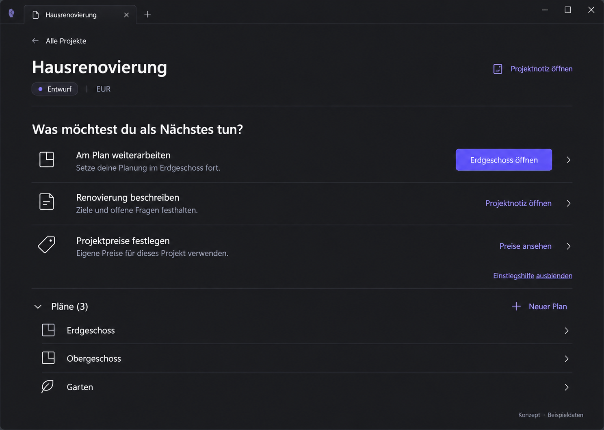

# P05 — Active project — dark theme



> Generated concept mockup with sample data, not an implementation screenshot. Original images illustrate German UI localization. English specification rules and the [UI copy table](../ui-copy.md) take precedence over incidental image details.

## Purpose and entry
Perform the same project work in the selected dark Obsidian theme. Same entry as P02; host controls theme, not another plugin setting.

## Layout and interactions
Same hierarchy, content, and actions as P02. Semantic surfaces, text, borders, and focus follow host theme. Theme changes preserve project, plans, guidance visibility, drafts, and scroll.

## Use cases
- UC-P05-01: Switch Obsidian to dark during project work.
- UC-P05-02: Recognize warnings and focus with another accent.

## Components and data contract
Same components as P02, no duplicate dark components. DOM uses semantic CSS variables. No new domain data; theme signals affect presentation only.

## Empty, error, and special states
Warnings, errors, disabled states, and focus remain distinguishable. Missing custom-theme variables follow existing host/adapter rules, not arbitrary hardcoded purple.

## Keyboard, focus, and narrow layouts
Measure contrast in rendered DOM: this image is no WCAG measurement evidence. Test focus on dark surfaces and with non-purple accent.

## Acceptance criteria
- No fixed light/dark palette.
- Content/behavior matches P02.
- Actual contrast/focus verification remains a release gate.

```gherkin
Given a project is open
When Obsidian switches from light to dark
Then project, plan list, and focus are retained
And text and controls use the new host colors
```

## Image clarifications
Visual reference, not a plugin screenshot or evidence for all custom themes.

## Shared rules and verification

The [state/navigation rules](../states-and-navigation.md), [component library](../components/component-library.md), and [repository reconciliation](../implementation/repository-reconciliation-and-backlog.md) also apply. Document/image links are checked in this package. Runtime interactions, theme contrast, and screen-reader behavior have not been verified in the plugin. See the [verification plan](../implementation/verification-plan.md).

