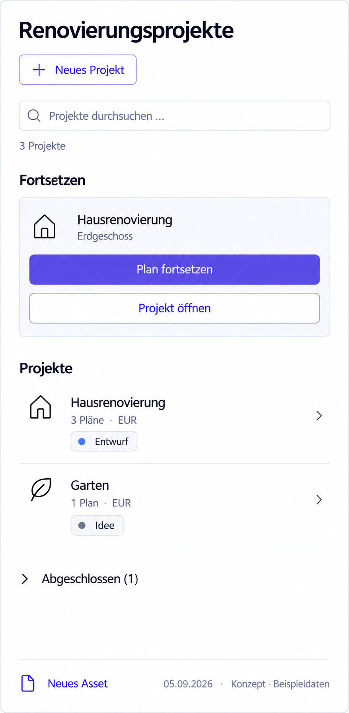

# P06 — Project overview — narrow leaf



> Generated concept mockup with sample data, not an implementation screenshot. Original images illustrate German UI localization. English specification rules and the [UI copy table](../ui-copy.md) take precedence over incidental image details.

## Purpose and entry
Find projects and resume in a narrow Obsidian workspace. Same as P00; container width controls layout. Target reference: about 460 CSS px. Narrow desktop and read-only mobile have distinct capabilities.

## Layout and interactions
Header wraps; search spans width. Resume context/actions stack. Project names, facts, and status take multiple lines. Date may be omitted; completed disclosure stays accessible. P00 rules apply to supported capabilities. Resizing is not navigation and retains search/focus. Long names may take space.

## Use cases
- UC-P06-01: Split a pane and still resume the right context.
- UC-P06-02: Open a long project name without horizontal scroll.

## Components and data contract
Responsive ProjectList, ProjectRow, ContinueRow, ProjectFilter; no second mobile data pipeline. Same data as P00. Visually omitted date retains its value.

## Empty, error, and special states
Warnings wrap fully. No-match creation stays usable on desktop. Mobile honors read-only scope. Empty list has no redundant search region.

## Keyboard, focus, and narrow layouts
44 CSS px touch targets are a design goal; test 360 px and 200% zoom. Raster dimensions are not CSS measurements. System keyboard and OS chrome are outside mockup.

## Acceptance criteria
- No supported core action hidden solely for compactness.
- No forced five columns.
- No resize remount causing state loss.

```gherkin
Given the project list is filtered
When I resize the desktop leaf to 460 CSS px
Then search text is retained
And both Resume-entry actions remain accessible
And no horizontal scrolling is required
```

## Image clarifications
The entire long composition is shown; shorter real leaves scroll vertically. Illustrative footer is not product content.

## Shared rules and verification

The [state/navigation rules](../states-and-navigation.md), [component library](../components/component-library.md), and [repository reconciliation](../implementation/repository-reconciliation-and-backlog.md) also apply. Document/image links are checked in this package. Runtime interactions, theme contrast, and screen-reader behavior have not been verified in the plugin. See the [verification plan](../implementation/verification-plan.md).

