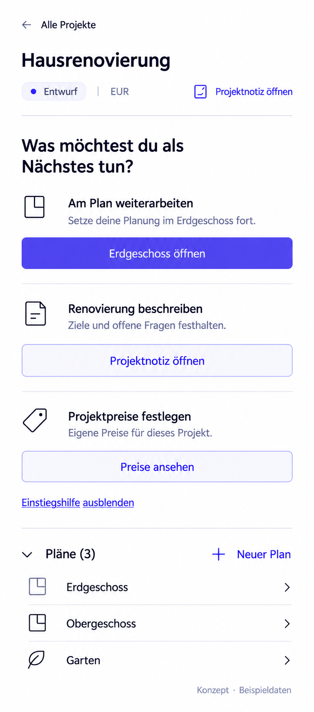

# P07 — Active project — narrow leaf



> Generated concept mockup with sample data, not an implementation screenshot. Original images illustrate German UI localization. English specification rules and the [UI copy table](../ui-copy.md) take precedence over incidental image details.

## Purpose and entry
Retain project orientation and direct plan selection at narrow widths. Same as P02; about 460 CSS px, normal vertical scroll at shorter heights. Desktop editing and read-only mobile remain distinct.

## Layout and interactions
Header/title may wrap. Each entry action sits below its explanation. Optional guidance precedes expanded plans. P02 rules apply to supported capabilities. Guidance visibility is deliberate; never auto-hide on each resize. New plan may occupy its own section-header line on desktop.

## Use cases
- UC-P07-01: Continue project work in a split desktop leaf.
- UC-P07-02: Hide guidance and reach plans directly.

## Components and data contract
Responsive ProjectHeader, ProjectEntryGuidance, ProjectEntryAction, PlanList from P02. Same read models; no new mobile route or duplicate selection.

## Empty, error, and special states
Warnings and return remain reachable. A sticky header must not cover most content on short screens.

## Keyboard, focus, and narrow layouts
No smaller type to force a fit. Header note access may wrap. Focus/reading order follows visual order. Where editing is supported, dialogs remain usable with an on-screen keyboard; this grants no mobile write capability.

## Acceptance criteria
- Project identity and back navigation stay visible or accessible.
- No mandatory horizontal navigation.
- Same guidance/direct-access state as wide layout.

```gherkin
Given getting-started guidance is visible
When I open the project in a narrow leaf
Then actions appear below their explanations
And normal vertical scrolling reaches the plan list
```

## Image clarifications
Header may wrap. The image does not require all content to fit in a typical screen height.

## Shared rules and verification

The [state/navigation rules](../states-and-navigation.md), [component library](../components/component-library.md), and [repository reconciliation](../implementation/repository-reconciliation-and-backlog.md) also apply. Document/image links are checked in this package. Runtime interactions, theme contrast, and screen-reader behavior have not been verified in the plugin. See the [verification plan](../implementation/verification-plan.md).

